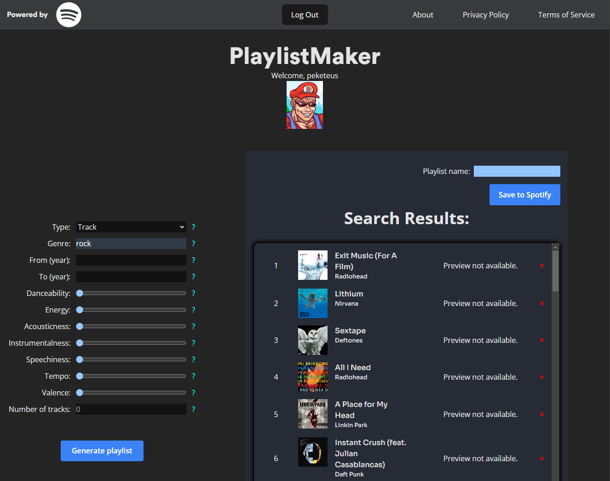

# PlaylistMaker



**PlaylistMaker** is a web application built with React that utilizes the Spotify API to create randomly generated playlists based on the search parameters. The application then creates a link to your spotify account with the generated playlist added to it.

## Table of Contents

- [Features](#features)
- [Tech Stack](#tech-stack)
- [Installation](#installation)
- [Usage](#usage)
- [Environment Variables](#environment-variables)
- [License](#license)

## Features

- **User Authentication**: Log in through Spotify's authentication system.
- **Search Functionality**: Search for songs for a playlist with different variables: Genre, year, energy, danceability.
- **Playlist Management**: Add new playlists to your account with randomly selected songs.
- **Track preview**: Listen to short previews of tracks within the app.

## Tech Stack

- **Frontend**: React (Javascript), Tailwind CSS
- **Backend**: Spotify Web API
- **Authentication**: OAuth 2.0 via Spotify's authentication system ([RFC6749](https://datatracker.ietf.org/doc/html/rfc6749))

## Installation

### Prerequisites

- **Node.js**: Make sure you have Node.js installed. You can download it from [Node.js official website](https://nodejs.org/)

1. Clone this repository to your local machine:

    ```bash
    git clone https://github.com/username/playlistmaker.git
    cd playlistmaker
    ```

2. Install the dependencies:

    ```bash
    npm install
    ```

3. Create a `.env` file in the root directory and add the necessary [environment variables](#environment-variables).

    You need your own clientID to be able to use this application. You can obtain the clientID from Spotify: [Spotify Developer Portal](https://developer.spotify.com/documentation/web-api)

4. Start the development server:

    ```bash
    npm start
    ```

## Usage

1. Open the app in your browser and log in with your Spotify account.
2. Use the search feature to find songs for your playlist.
3. Select songs and add them to a new playlist.

## Environment Variables

Create a `.env` file in the root directory and add the following variables:

    - **VITE_API_CLIENT_ID=_yourClientID_**: Your Spotify application's client ID

Replace these with your own Spotify application credentials, which you can obtain from the [Spotify Developer Portal](https://developer.spotify.com/dashboard/applications).

**Note**: Keep your `.env` file safe! Never reveal your client secret publicly! If you suspect that the secret key has been compromised, regenerate it immediately.

## License

This project is licensed under the Apache License 2.0. See the [LICENSE](LICENSE.txt) file for more details.

This project uses a code base for Spotify authorization, implemented with the PKCE (Proof Key for Code Exchange) method. This authorization flow enables secure Spotify authentication within our application. The original authorization code is licensed under the Apache License 2.0, and we have made modifications to tailor it to our specific needs.

The original code for the Spotify PKCE authorization can be found here: [repository](https://github.com/spotify/web-api-examples/blob/master/authorization/authorization_code_pkce/public/app.js).
